CUDA Path Tracer
================

**University of Pennsylvania, CIS 565: GPU Programming and Architecture, Project 3**

* Rony Edde (redde)
* Tested on: Windows 10, i7-6700k @ 4.00GHz 64GB, GTX 980M 8GB (Personal Laptop)

This is a path tracer running on the GPU using CUDA.
* 

* Controls
  * Esc to save an image and exit.
  * S to save an image. Watch the console for the output filename.
  * Space to re-center the camera at the original scene lookAt point.
  * A for enabling / disabling anti-aliasing.
  * 0 for resetting depth of field to zero focal length and zero blur.
  * - for decreasing depth of field.
  * = for increasing depth of field.
  * [ for decreasing focal length.
  * ] for increasing focal length.
  * C for enabling / disabling caching and sorting.
  * X for enabling / disabling subsurface scattering (only materials with sss).
  * F for enabling / disabling stream compaction and ray sorting by material.
  * T for enabling / disabling benchmark tests.
  * 1 reduce soft reflections/refractions.
  * 2 increase soft reflections/refractions.
  * Keyboard up shifts the camera up.
  * Keyboard down shifts the camera down.
  * Keyboard left shifts the camera left.
  * Keyboard right shifts the camera right.
  * Left mouse button to rotate the camera.
  * Right mouse button on the vertical axis to zoom in/out.
  * Middle mouse button to move the LOOKAT point in the scene's X/Z plane.

* Features
  * BSDF shading with diffuse, reflection and refractions.
  * Thrust stream compaction for eliminating unused rays.
  * Ray sorting by material id.
  * Caching rays on first bounce to avoid repetitive regeneration.

* Additional features
  * Fresnel refraction using Shlick's 5th power implementation.
  * soft reflections and refractions.
  * Anti-aliasing using uniform spherical distribution to avoid polar distribution.
  * Obj file format loader with auto loading mtl material file suppport.
  * Depth of field using uniform spherical distribution and focal point jitter.  
    Caching must be disabled for this to work (C).
  * Subsurface scattering by depth tracing and uniform scattering.

* Fresnel reflection refraction
  * Using [Shlick's approximation formula](https://en.wikipedia.org/wiki/Schlick%27s_approximation),
    we can decide when to break our rays into reflection or refraction.
    There is still a random factor in place due to the nature of path tracing but this gives a smooth
    transition between reflection and refraction.
    We start with basic reflection only.  Here the ray is just reflected when it hits the surface.
    There are no other randomization factors although this would be beneficial for soft reflections later on.
    Here's what we get when we reflect the ray:
    * 
    Now we have to implement refractions.  In order to do this we need to know if the ray is inside the surface
    or outside so that we can refract with the correct index of refraction or reflect.  The index of refraction
    used entering the surface is the inverse of the ray exiting the surface.  We keep track of the inside flag and
    update that accordingly. We then apply our fresnel function to determine if we reflect or refract.
    Bur before we do so, we need to decide beforehand if the ray will be refracted instead of just using glm::refract
    since we need to know how to set the inside flag.  Once this is done we apply our fresnel function and we are done.
    Here's what refraction loks like when we don't check for change in surface penetration.
    * 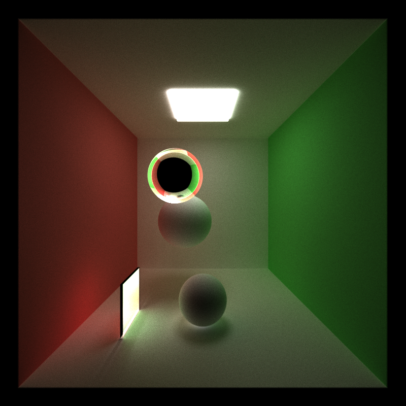
    And after fixing with proper separation, the final result can be seen:
    * 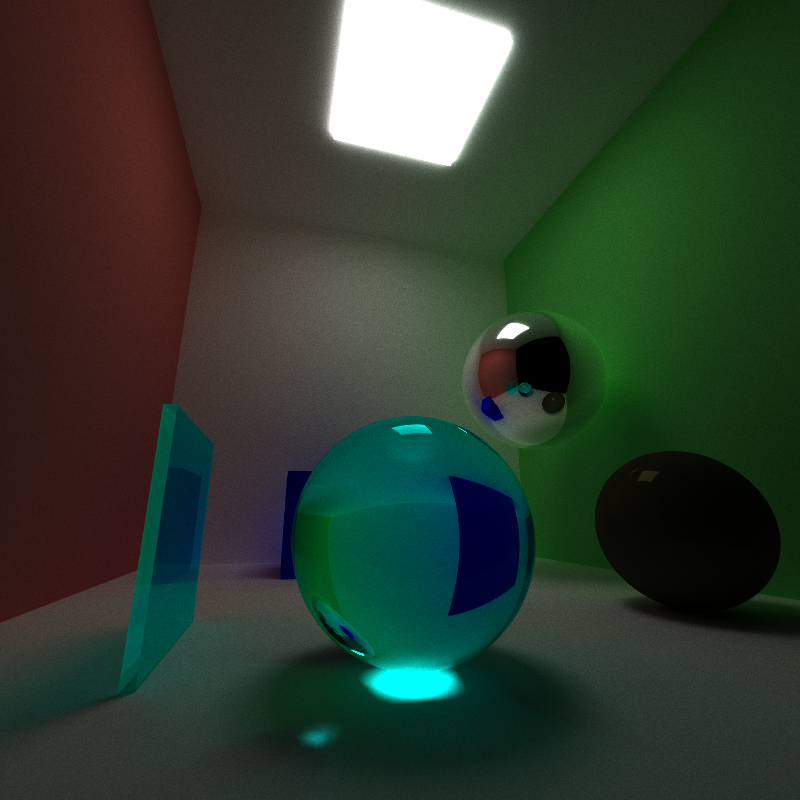

    Here are a few tests with different reflection / refraction coeficients
    * 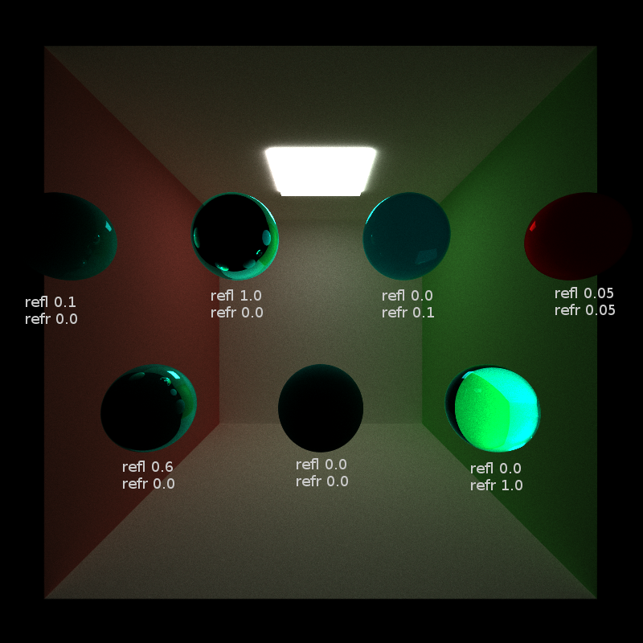

* Soft reflections
    When using a uniform distribution function, one can achieve soft reflections and refractions
    Here's a reflection and refraction test
    Once we check for surface penetration and apply our fresnel function we get this:
    * 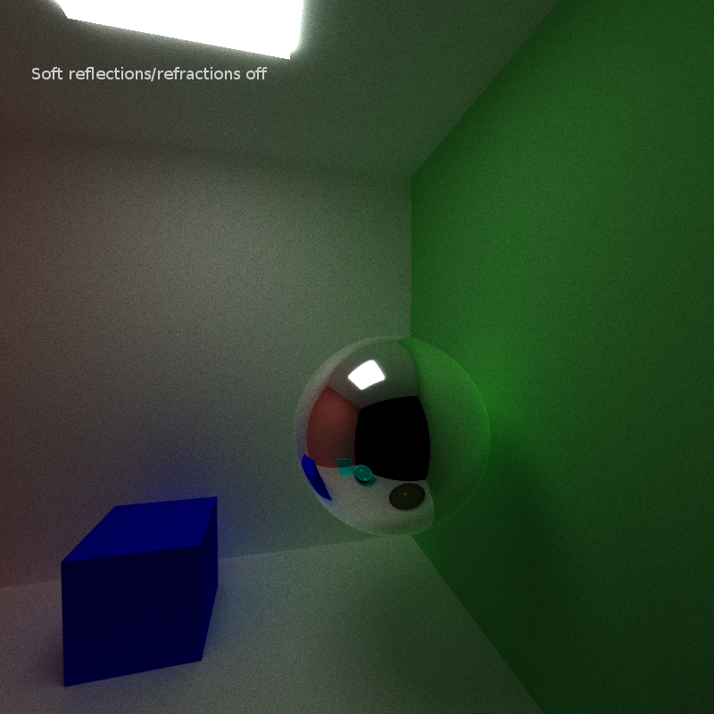
    And finally when we enable soft reflections, we get this:
    * 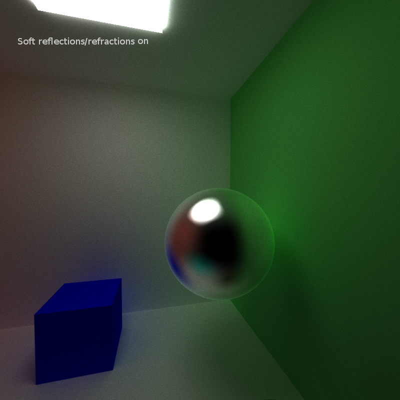

* Anti-aliasing
  * jittering the ray to produce antialiasing.  Initial tests uniformly
    blurred the image procucing undesirable effets.  In this image the 
    random generation was being recycled to identify the spread.
    * 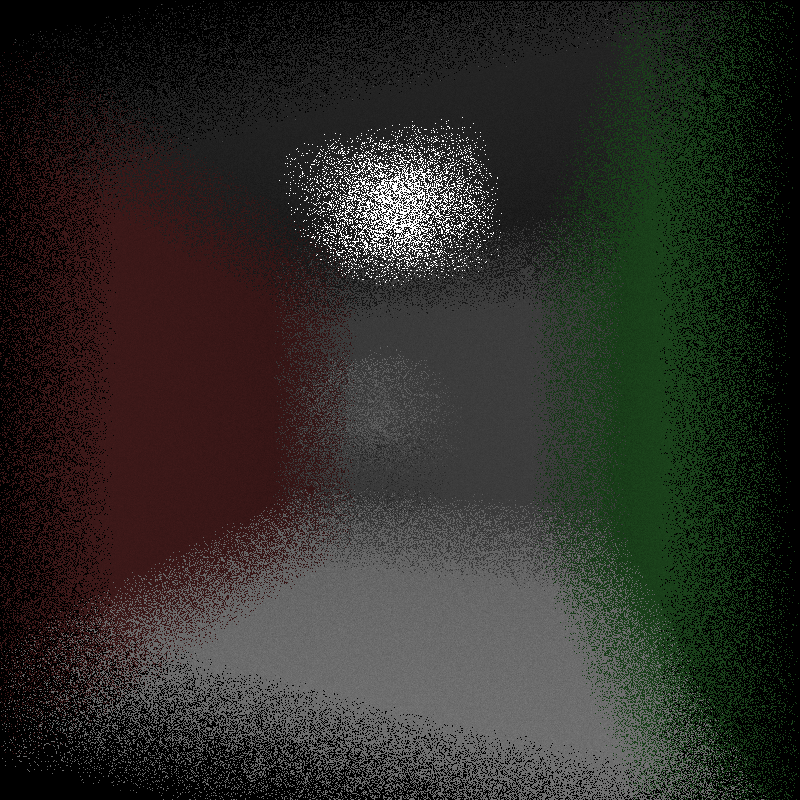

    Using a blur the size of 2 pixels produced a much better result.  
    Here's the final result after implementing
    a uniform spherical distribution.
    * 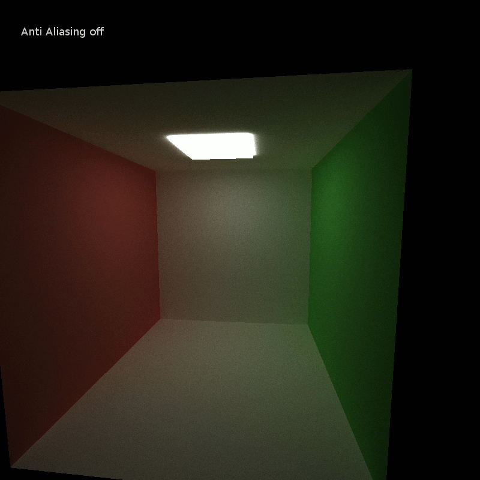

    * 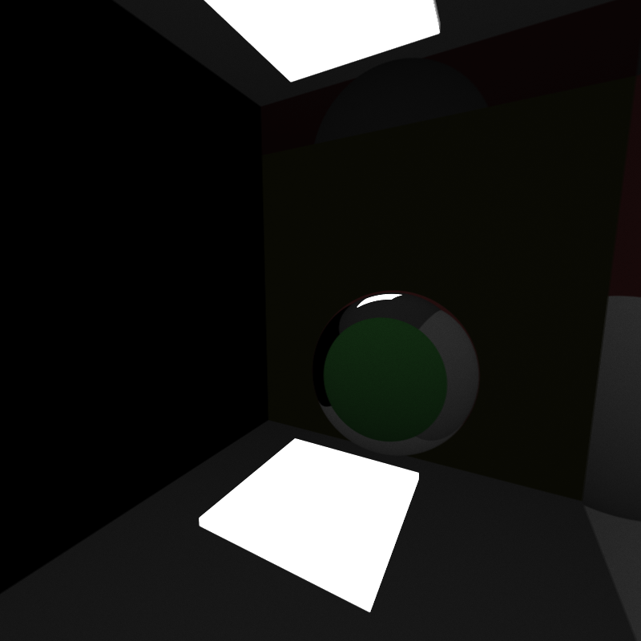

* Obj reader with mtl file support
  * Using [tinyObj](https://syoyo.github.io/tinyobjloader/), we can read obj data
    and material info and use the loaded geometry to compute our paths.
    This implementation supports polygons with normals and interpolates normal values
    in order to maintain smooth shading.  The biggest hurdle as is well known, is computing 
    the intersections of all the polygons in the scene.  This tends to get heavy very quickly
    which means that a KD-Tree solution or BSP or alike is inevitable.  Due to time constraints
    this was not possible but this is definitely worth pursuing.
    The obj loader looks for mtl files within the same directory as the obj.  If none exist,
    the objects loaded will have a default white material.  The material information is
    converted to our scene format and used for shading.
    Topological information is stored linearly due to the complexities of allocating pointers
    of pointers on the GPU.  While this is usually not desirable, the only disadvantage was the
    function parameters which increased.
    Each object is checked for intersection by checking the cached object bounding box.  If the
    object's bounding box intersects the ray, we go through all the polygons and check for 
    intersections.  One polygon at a time.  And this still preserves surface contuinuity since
    the normals are interpolated based on their barycentric coordinates.  The only exception
    is when the model's normals have been cusped before exporting them which is the desirable
    result.
    All 3D models are from [turbosquid](http://www.turbosquid.com)
    Here's a wolf model with smooth normals and a few cusped normals for creasing parts of the
    geometry:
    * 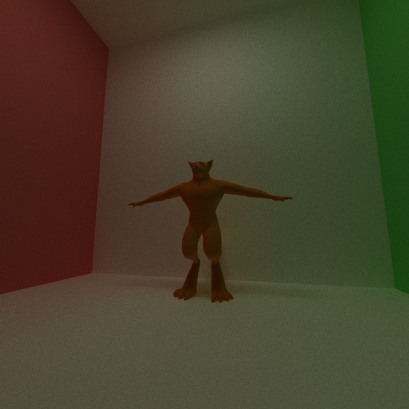

    And here's a model with completely cusped normals.
    * 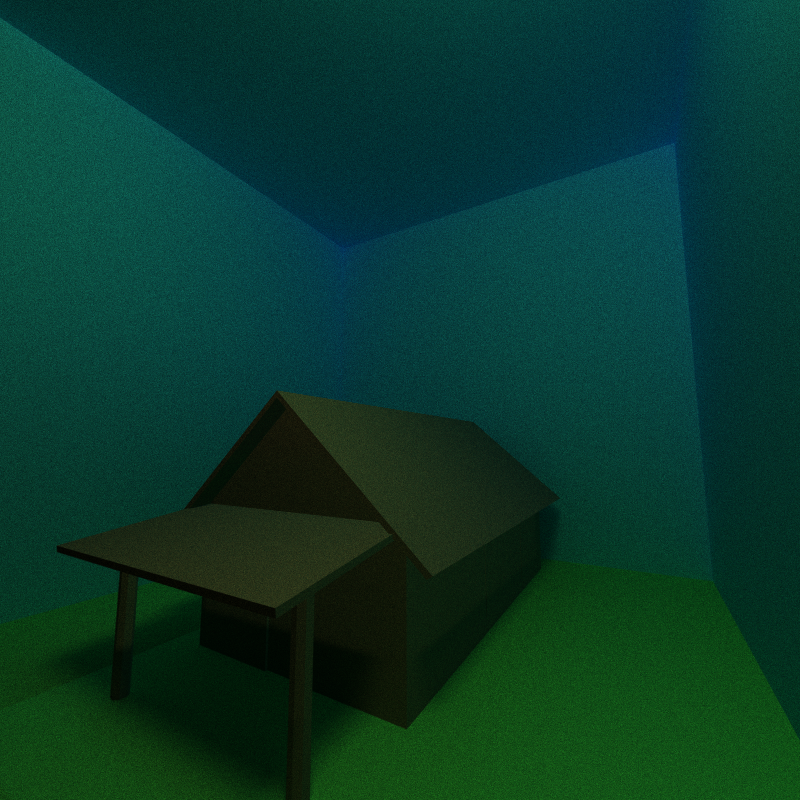

* Depth of field
  * By shifting the camera around the its focal length, we can produce a blur that increases with
    the distance from the focal point.  This in effect generated a depth of field similar to a camera
    focusing with a large aperture.
    Rotating the camera around it's focal point is not always straight forward because of the axis alignment
    problem.  That's why the spherical distribution needs to be uniform and not polar.  Furthermore,
    to support all camera directions, we need to make the angles valid.  So the main idea is to 
    generate a uniformly random distribution cone aligned to the Z axis and align this to the camera's
    look at vector.  This is then used to rotate the camera around the focal point offset.
    Here are a few results.
  * 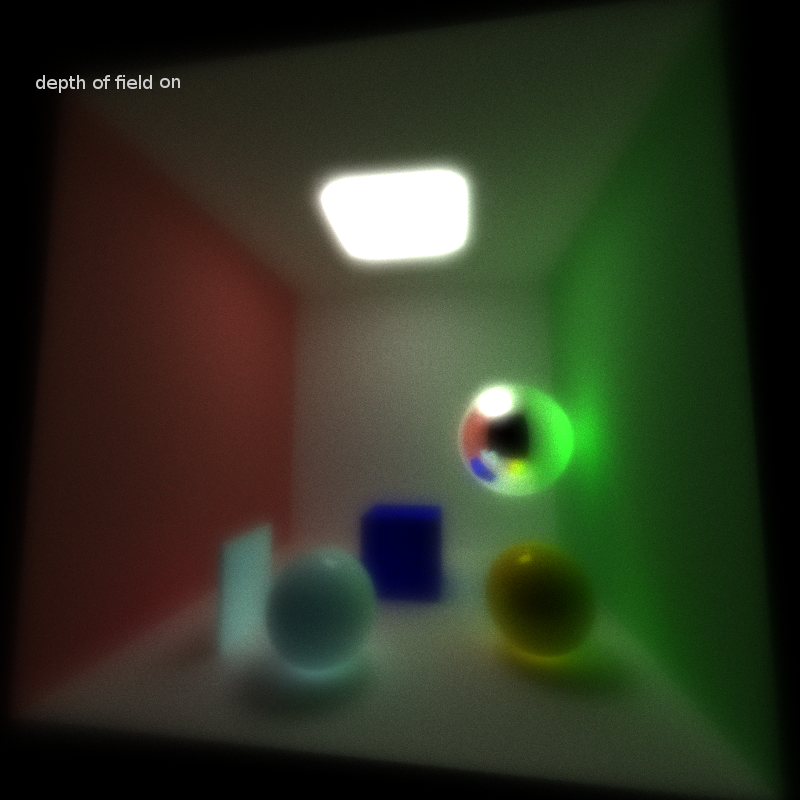
  * 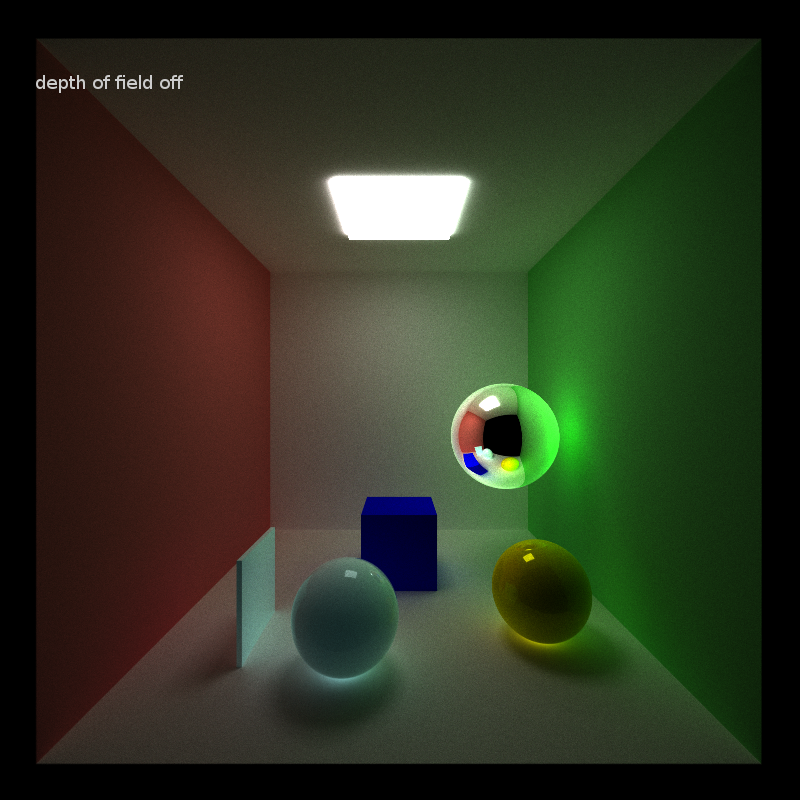
  * 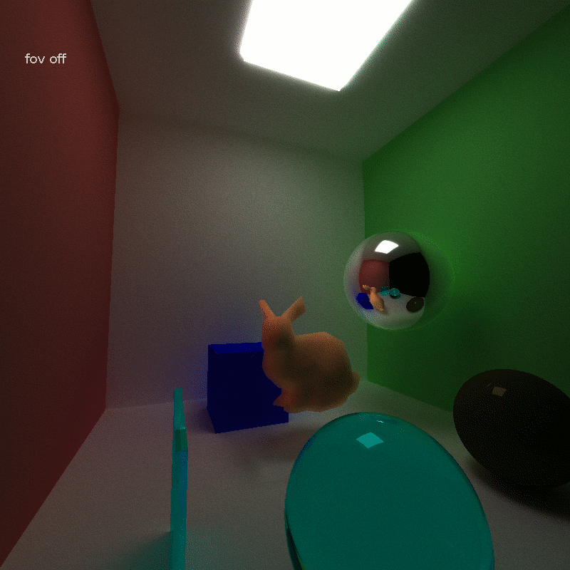

* Subsurface scattering
  * When enabled, every ray that hits the surface will get projected inside the surface with 
    a scattering factor.  The rays will bounce out of the surface and the depth travelled by
    the ray is computed and used for shading the final result.  This only applies with obj files
    that have a translucency color.  This effect can be enabled or disabled with the X key.
    When the depth calculation doesn't take into account a zero influence outside the surface, we get
    artifacts and in some cases this can be seen as banding.
    Here's what the low poly stanford bunny looks like with and without sss.
    * 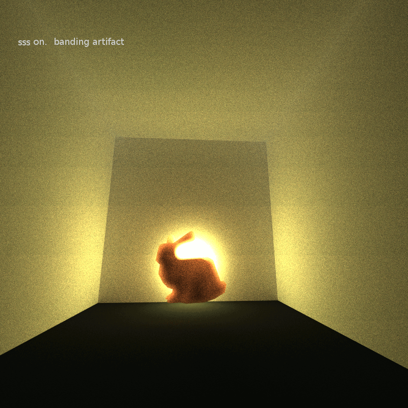

* Performance
  * Analysis on the time taken for the cuda calls is as follows.
    * The functions in question are 
      - generateRayFromCamera which generates rays from the camera.
      - pathtraceOneBounce which calculates one pass for the rays.
      - shadeMaterial which applies the BSDF functions to the rays.
  * The test runs 100 iterations using the following wedges:
    * caching off: no ray caching of the camera rays.
    * caching on: the initial camera rays are cached for reuse
    * no stream compaction: rays with final hit are not removed.
    * sorting off: ray sorting by material id is disabled.
    * blocksize 16/32/64/128/256 are tests running with different blocksizes.

  * The initial graph when all is put together is not particularly helpful.
    We notice slight improvements with caching and stream compaction but it
    is difficult to see clearly how every function compares.
    Here's the initial graph (lower is better):
    * 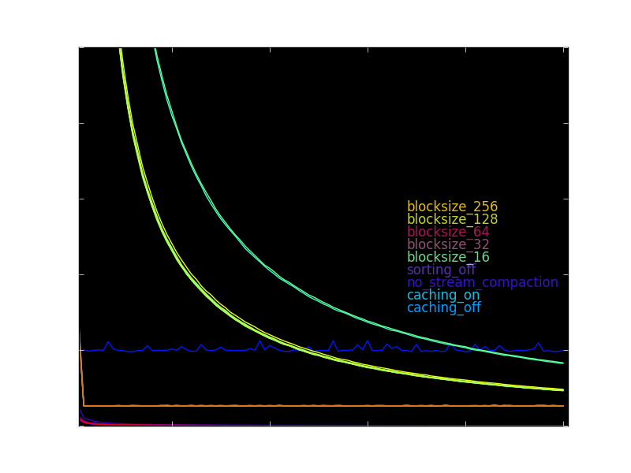

  * In order to get a better view of the result, we seperate the calls.  
    Here's what the calls to the pathTraceOneBounce function:
    * 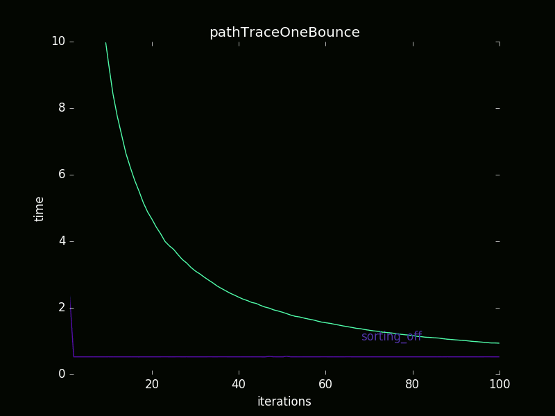
    And the calls to generateRaysFromCamera:
    * 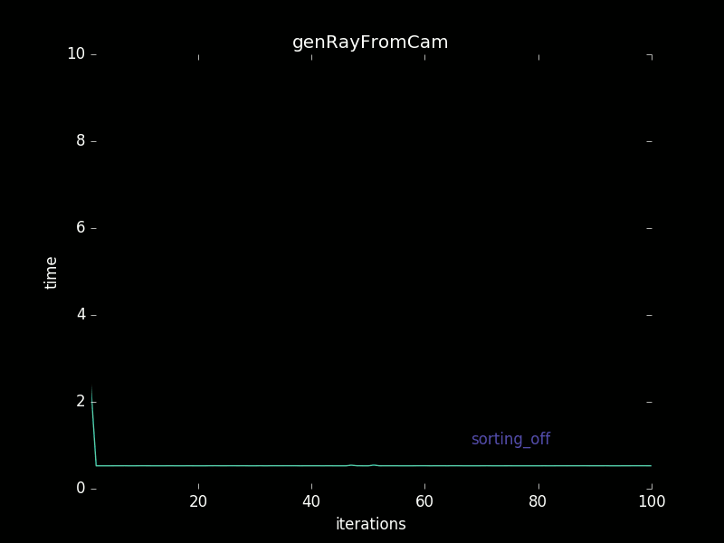
    We have a slightly better view on the performance advantage of caching but we still
    can't easily compare the results.
    In order to get a better comparison we generate a chart for all the tests by their category.
    We do this by averaging the results.  We now have the following charts:
    * 
    The shadeMaterial function is too fast to be shown so we plot it separately:
    * 

    Now we can clearly see what's happening. (lower is better)
    * genRayfromCam shows a pretty good improvement with ray caching.  This is expected
      since the rays that are being cached are reused instead being regenerated.  Changing
      block sizes didn't seem to make a big impact though.

    * pathTraceOneBounce shows quite a big drop in performance when disabling stream compaction.
      with double the time taken when stream compaction is disabled in a default scene. This
      obviously would be a much bigger impact if the scene was mostly background color.
      Again this is expected sine we recompute rays that would have been removed.  What was not
      expected was whit a block size of 16.  The performance hit of 1.8 times is considerable since 
      caching is enabled for all the block size benchmarks.  The hit is so considerable that it is 
      actually worse than not having stream compaction with an different block size.  
      This is possibly due to the use of a full warp for only 16 blocks underutilizing the processor 
      and stalling the remaining blocks.  The interesting thing to note is that a block size of 32 
      was the most efficient while increasing this slightly reduced performance.

    * shadeMaterial is now clearly visible in the isolated chart.  We can see that the results
      are similar to the pathTraceOneBounce function.  The only difference is that caching the
      rays did not affect the shading which is completely normal since the rays that are being
      passed are the same size.  But we do see a massive hit in performance again when caching
      is disabled.  This reduced the performance by 2.8 times which is very significant.
      Reducing the block size to 16 also had an impact.  Although being less than the one we got with
      pathTraceOneBounce, at 1.4 times the time needed, it's a 40% decrease in performance.

* Bloopers
  * inaccurate distribution
  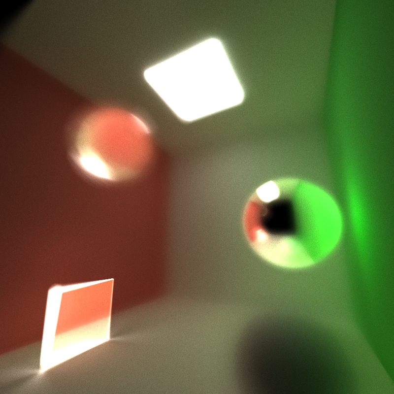

  * collisions gone wrong
  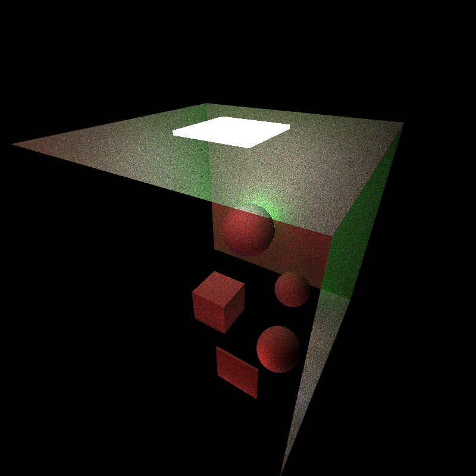

  * flat posters
  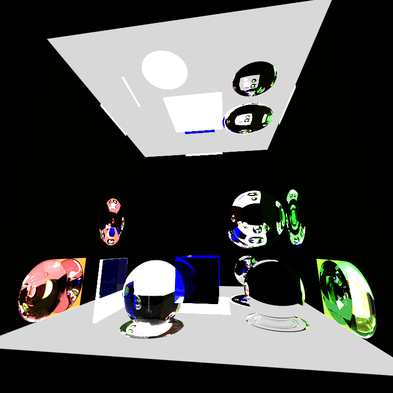

  * grids and lines from distorted camera
  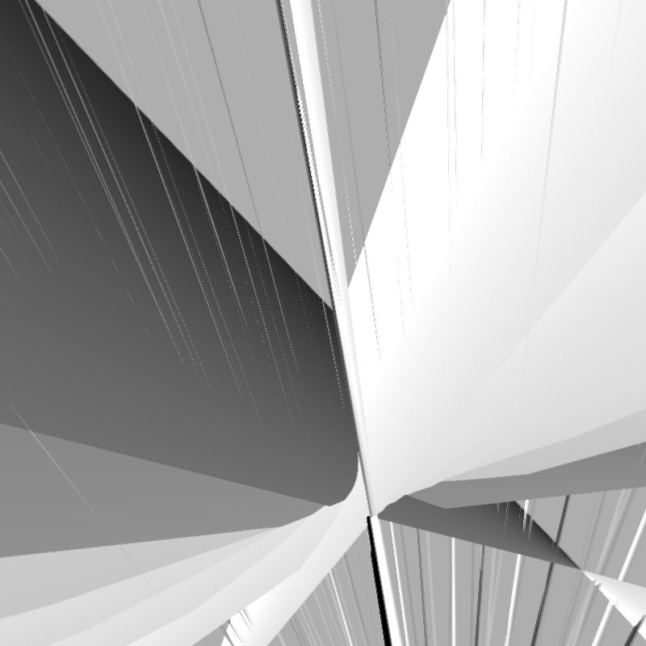

  * lack of precision
  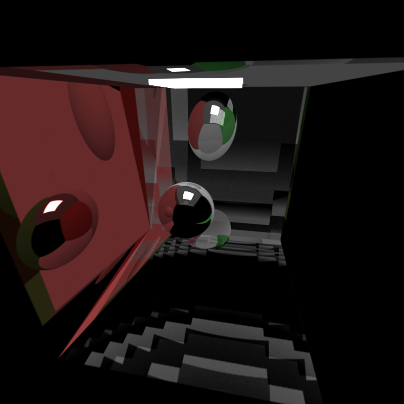

Thanks!
   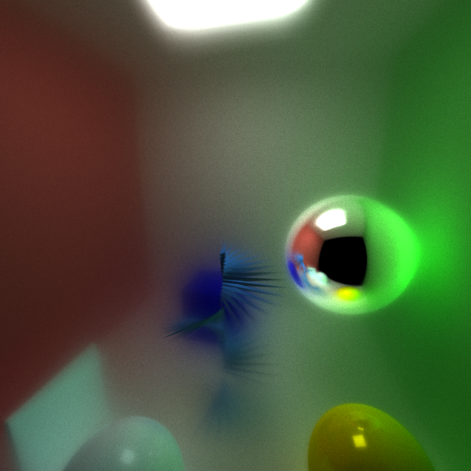
